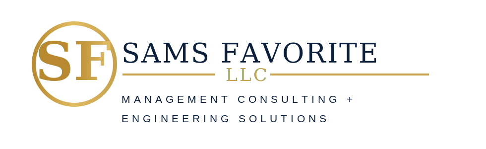

<!doctype html><html lang="en"><head><meta charset="utf-8"><meta name="viewport" content="width=device-width, initial-scale=1"><meta name="theme-color" content="#0B1F3A"><link rel="preconnect" href="https://fonts.googleapis.com"><link rel="preconnect" href="https://fonts.gstatic.com" crossorigin><link href="https://fonts.googleapis.com/css2?family=Inter:wght@400;600;700;800;900&display=swap" rel="stylesheet"><link rel="stylesheet" href="assets/css/style.css"><title>About | Sams Favorite LLC</title><meta name="description" content="About Sams Favorite LLC, a Dallas-based management consulting and engineering support firm."></head><body>

Dallas, Texas • Management Consulting + Engineering Solutions<a href="mailto:justin@samsfavorite.com">justin@samsfavorite.com</a> &nbsp; | &nbsp; <a href="tel:+18322027889">(832) 202-7889</a>

<nav class="nav">
<button class="menu">☰</button>
<a href="about.html">About</a><a href="services.html">Services</a><a href="government.html">Government</a><a href="contact.html">Contact</a><a class="btn gold" href="downloads/capability-statement.html" target="_blank">Capability Statement</a>

</nav><section class="page-hero">

About Sams Favorite LLC
<h1>Built for strategy, execution, and technical delivery.</h1>
Sams Favorite LLC is a Dallas-based management consulting and engineering support firm serving government, commercial, and teaming partners.

</section><section class="section">

<h2 class="headline">A consulting firm with practical engineering experience.</h2>

The company was created to provide responsive management consulting, technical documentation, and engineering support services to organizations that need reliable project execution.

Our near-term focus includes as-built documentation, existing condition drawings, Revit production, electrical support, cost estimating, and construction administration support.

<h3>Company Snapshot</h3>
<b>Company:</b> Sams Favorite LLC

<b>Location:</b> Dallas, Texas

<b>Founded:</b> 2026

<b>Business Structure:</b> Limited Liability Company

<b>UEI:</b> GS8ACMM9HP65

<b>CAGE:</b> Pending SAM activation

<b>Status:</b> Small Business / SDB positioning

</section><footer class="footer">

<h4>Sams Favorite LLC</h4>
Management Consulting + Engineering Solutions for government, commercial, and teaming partners.

<h4>Services</h4>
<a href="services.html">Management Consulting</a> <a href="services.html#engineering">Engineering Support</a> <a href="government.html">Government Contracting</a>

<h4>Contact</h4>
<a href="mailto:justin@samsfavorite.com">justin@samsfavorite.com</a> <a href="tel:+18322027889">(832) 202-7889</a> Dallas, Texas

© 2026 Sams Favorite LLC. All rights reserved.
</footer></body></html>